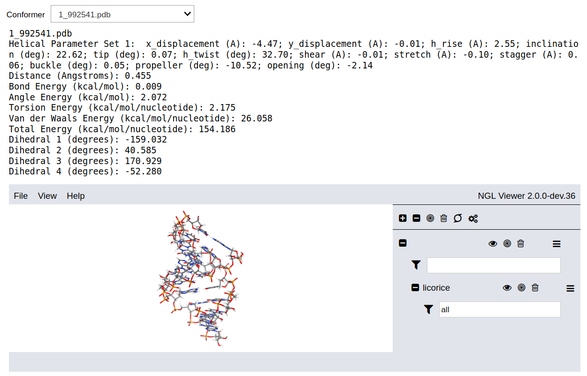

# proto-Nucleic Acid Builder (pNAB)
## Try the Package: [](https://mybinder.org/v2/gh/GT-NucleicAcids/pnab/HEAD?labpath=binder%2Fdriver.ipynb)
## Read the documentation: [](https://proto-nucleic-acid-builder-v1-1-5.netlify.app/html/index.html)

[](https://ci.appveyor.com/project/alenaizan/pnab-8kj78/branch/master)

## Overview
The proto-Nucleic Acid Builder is a program for modeling the 3D strucutres of DNA, RNA, and nucleic acid analogs. Nucleic acids with alternative backbones or nucleobases can be constructed by the program by supplying the 3D structure of isolated backbones or nucleobases. The program can perform a helical parameter search and backbone conformation search and find reasonable nucleic acid structures. Geometric and energetic criteria are used to evaluate candidate structures. The program is written in C++ and Python, and has a graphical user interface. The program is available for the Linux, MacOS, and Windows platforms. 


## Installing the Pre-compiled Package Using the conda package manager
To install the conda package, first install miniconda/anaconda. Then create a new environment for pNAB,
```
conda create -n pnab -c conda-forge pnab
conda activate pnab
```
## Compiling the Package
The files `install.sh` and `install.bat` provide example scripts for compiling the package for the Linux and Windows platforms. 

## Documentations:
Development version: [](https://gt-nucleicacids.github.io/pnab/html/index.html)

Latest release: [](https://proto-nucleic-acid-builder-v1-1-5.netlify.app/html/index.html)

## Citation:
Alenaizan, A.; Barnett, J. L.; Hud, N. V.; Sherrill, C. D.; Petrov, A. S. The Proto-Nucleic Acid Builder: A Software Tool for Constructing Nucleic Acid Analogs. *Nucleic Acids Res*. **2021**, *49* (1), 79–89.
